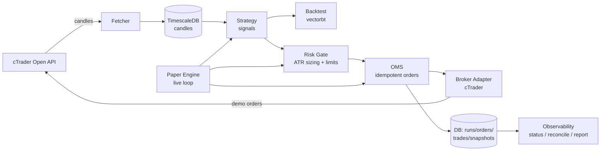
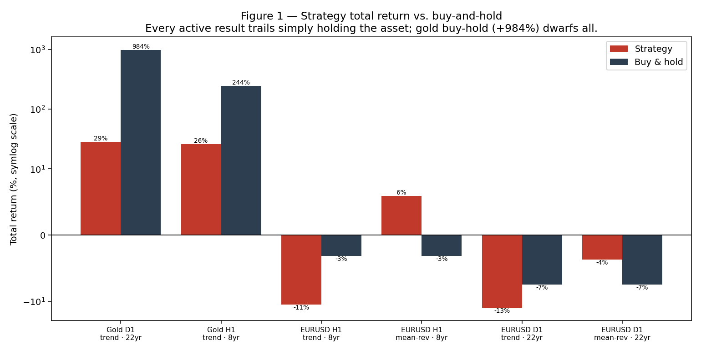
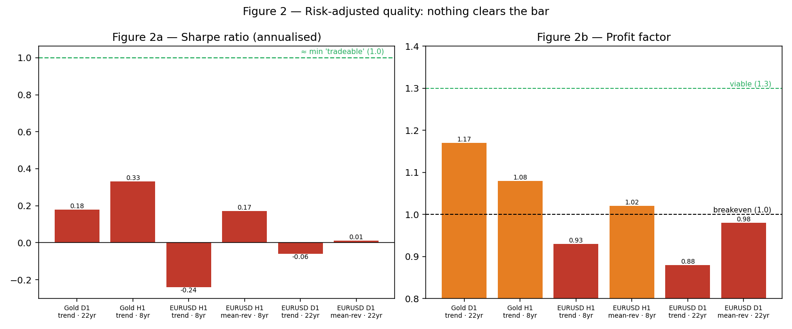
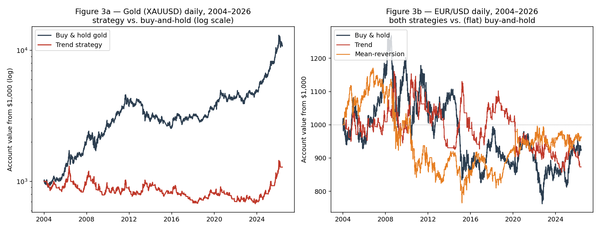

# Building a Rules-Based Algorithmic Trading System, and an Empirical Test of Whether Simple Technical Strategies Have a Tradeable Edge

**Author:** Masimba
**Date:** 29 May 2026
**Repository:** `github.com/MasimbaTakudzwa/trading-bot`
**Stack:** Python 3.12 · cTrader Open API (FP Markets) · TimescaleDB · vectorbt

---

## Abstract

This report documents the design, implementation, and empirical evaluation of a production-grade algorithmic trading bot built from scratch in Python. The system spans the full pipeline — market-data acquisition, persistence, strategy signal generation, vectorised backtesting, volatility-based risk management, an order-management system (OMS) with a broker adapter, a live paper-trading engine, and observability tooling — integrated against a real broker (FP Markets) via the cTrader Open API, with defence-in-depth safeguards to prevent unintended live trading.

The engineering objective was met in full: a safe, tested (114 automated tests), broker-integrated system that places correctly-sized, risk-checked, idempotent orders on a demo account. The **trading** objective — a durable, profitable edge from simple technical rules — was **not** met, and this report argues that this is the empirically expected outcome. Across **six backtests** spanning two instruments (gold, EUR/USD), two strategy families (trend-following, mean-reversion), two timeframes (hourly, daily), and horizons up to **22 years**, no configuration produced a risk-adjusted edge that survives realistic costs; in every clean comparison, passive buy-and-hold matched or beat the active strategy. The most striking result: over 22 years a trend strategy on gold returned **+28.6%** while simply holding gold returned **+983.6%**. We present the engineering, the methodology, the full results, an honest discussion of *why* no edge was found, the threats to validity, and recommended future work. The contribution is twofold: a reusable trading-system architecture, and a rigorously-established negative result of the kind retail practitioners rarely reach before committing capital.

---

## Table of Contents

1. [Introduction & Objectives](#1-introduction--objectives)
2. [Constraints & Context](#2-constraints--context)
3. [System Architecture](#3-system-architecture)
4. [The cTrader API Implementation](#4-the-ctrader-api-implementation)
5. [Strategy Design](#5-strategy-design)
6. [Risk Management](#6-risk-management)
7. [Execution & the Order-Management System](#7-execution--the-order-management-system)
8. [Backtesting Methodology](#8-backtesting-methodology)
9. [Results](#9-results)
10. [Forward (Paper) Testing](#10-forward-paper-testing)
11. [Discussion](#11-discussion)
12. [Limitations & Threats to Validity](#12-limitations--threats-to-validity)
13. [Future Work](#13-future-work)
14. [Conclusion](#14-conclusion)
15. [Appendices](#15-appendices)

---

## 1. Introduction & Objectives

The goal was to build — not buy or wire together — a complete algorithmic trading bot for a retail-scale account, and to use it to answer a concrete empirical question:

> **Can a disciplined, rules-based technical strategy, executed by a well-engineered bot, produce a durable edge on liquid markets after realistic costs?**

Two distinct objectives followed:

- **Engineering objective.** Build a safe, testable, broker-integrated system covering the entire lifecycle: data → signals → backtest → risk → execution → live loop → monitoring.
- **Trading objective.** Identify a strategy/instrument with a positive, repeatable, risk-adjusted edge worth trading with real money.

A core principle governed the whole project: **the bot must never place a live order until its behaviour has been verified.** This shaped a defence-in-depth safety design (Section 3.3) and a "validation-first" workflow — build, backtest, then paper-trade on a demo account, deferring any live capital.

---

## 2. Constraints & Context

The problem was shaped by the operator's real-world constraints, which materially narrowed the design space:

| Constraint | Implication |
|---|---|
| Operator located in **Zimbabwe** | Most major brokers (and all US-based ones) do not accept clients; broker choice was severely restricted. |
| **Free API** required (no recurring cost) | Ruled out paid data/execution vendors; drove the choice of cTrader Open API. |
| **Sub-$1,000** account | Minimum contract sizes become a hard constraint (Section 6.3). |
| **No crypto** (viewed as purely speculative) | Excluded the most API-accessible retail market. |
| **Stability preferred** | Favoured simple, well-understood technical strategies over opaque/high-turnover ones. |

**Broker selection.** After surveying options, **FP Markets** (cTrader Raw demo account) was selected as the only cTrader broker found to accept Zimbabwean clients while exposing a free, programmatic API.

**Market pivot.** The project began on FX majors but pivoted mid-way: *"currency trading is way too hard to predict and is de-railed by government decisions."* The focus moved to commodities (precious metals) and indices. EUR/USD is retained throughout this report as a **control instrument** — not as a live target, but because (a) it is the only instrument whose minimum size fits a $1,000 account, and (b) as a non-appreciating currency pair it provides a *flat* buy-and-hold benchmark, isolating pure strategy skill from asset drift.

---

## 3. System Architecture

### 3.1 Pipeline

The system is organised as a one-directional pipeline of small, independently-testable components communicating through well-defined interfaces (Python `Protocol`s). Strategies never import a broker; the broker is swappable behind an adapter.



### 3.2 Component summary

| Layer | Module | Responsibility |
|---|---|---|
| Data | `data/ctrader_fetcher`, `data/candles` | Paginated candle download; idempotent upsert into TimescaleDB; DB→DataFrame loader. |
| Protocol | `data/ctrader_protocol` | Sync facade over the Twisted-based SDK (via `crochet`); auth; send/recv; retry. |
| Strategy | `strategies/donchian`, `strategies/mean_reversion` | Pure signal generators (look-ahead-safe). |
| Backtest | `backtest/runner` | vectorbt portfolio simulation with a realistic cost model. |
| Risk | `risk/sizing`, `risk/limits`, `risk/safety` | ATR volatility sizing; per-trade/daily/exposure limits; kill switch; live-trading guards. |
| Execution | `execution/base`, `execution/instruments`, `execution/ctrader_broker` | Broker `Protocol`; unit↔volume conversion + min-size guard; cTrader adapter. |
| OMS | `oms/engine`, `oms/store`, `oms/paper`, `oms/reconcile`, `oms/reporting` | Sizing→risk-check→idempotent placement; run persistence; live loop; reconciliation; reporting. |
| Interface | `cli` | `tbot` Typer CLI: `fetch`, `backtest`, `paper`, `status`, `reconcile`, `report`, `safety`. |

### 3.3 Defence-in-depth safety

Because the operator's prime directive was "never trade live until verified," live order placement is gated by **three independent layers**, all of which must pass:

1. **Host isolation** — configuration determines the demo vs. live endpoint.
2. **`ALLOW_LIVE_TRADING` switch** — defaults to `false`; live orders are impossible unless explicitly enabled.
3. **Account `isLive` check** — the broker adapter verifies the authenticated account's live/demo status before any order.

The `paper` command additionally hard-requires `CTRADER_ENV=demo`. Position-reducing actions (closes, the kill switch) are intentionally *not* gated, so the bot can always flatten risk. Throughout all testing in this report, the live account was never touched.

---

## 4. The cTrader API Implementation

The cTrader Open API is a **protobuf-over-TLS** protocol (port 5035) delivered through an official SDK built on the **Twisted** asynchronous reactor. Integrating it into an otherwise synchronous codebase was the single hardest piece of engineering.

**Sync facade via crochet.** The Twisted reactor is run in a background thread (`crochet`), and a thin facade (`CTraderProtocol`) exposes blocking `connect()` / `send()` methods. This keeps Twisted out of the strategy, risk, and CLI code entirely.

**Authentication.** A three-step ceremony: TLS connect → `ProtoOAApplicationAuthReq` (app credentials) → `ProtoOAAccountAuthReq` (account + OAuth access token). A separate OAuth 2.0 authorization-code flow (`tbot ctrader login`, a local callback server) obtains and refreshes tokens.

**Encoding facts** (verified against live specs, and a frequent source of bugs):

| Quantity | Rule |
|---|---|
| Price | scaled by `÷100000` uniformly |
| Order volume | `volume = units × 100` (1,000 units of EUR/USD = volume 100,000) |
| Money | scaled by `÷10^moneyDigits` |
| Responses | delivered as `ProtoMessage` envelopes; must be `Protobuf.extract()`-ed before use |

**Resilience.** `send()` is wrapped in a `tenacity` retry that retries *transient* transport failures (connection drops, timeouts) with exponential backoff, while letting *logical* API errors propagate immediately. Re-sending is safe because every order carries an idempotency key (Section 7). This retry was hardened after a real failure (Section 10).

---

## 5. Strategy Design

Two complementary, deliberately simple strategies were implemented. Both are **pure functions** of price (no I/O), making them identical in backtest, paper, and live — and both are **look-ahead-safe**: every indicator at bar *t* is computed only from bars *t−1* and earlier (`.shift(1)`), then compared to bar *t*'s close.

### 5.1 Donchian channel breakout (trend-following)

A stripped-down Turtle system. **Long** when close breaks above the highest high of the prior *N* bars; **exit** when it falls below the lowest low of the prior *M* bars (shorts mirror). Tested with the classic long-term parameters **entry = 55, exit = 20**. An optional long-SMA trend filter exists but was left off for the headline tests.

### 5.2 Bollinger-band mean-reversion

Bets that price snaps back to its mean. **Long** when close falls below the lower band (mean − *k*·σ over *N* bars); **exit** at the mean (shorts mirror). Tested at **period = 20, k = 2.0**. Rationale: FX majors *range* rather than trend in the modern regime, so fading extremes fits their character better than chasing breakouts. Documented failure mode: a strong trend that does not revert.

These two are intentionally opposite bets, letting us test both market characters: trend-following expects persistence; mean-reversion expects reversion.

---

## 6. Risk Management

### 6.1 Volatility position sizing

Every trade risks a constant fraction of equity. Given a stop distance and the money value of a one-point move, the size that risks exactly `equity × risk_fraction` is:

```
units = (equity × risk_fraction) / (stop_distance × value_per_point)
```

The stop distance is volatility-scaled: **stop = ATR(14) × 2**. Calm markets get a tighter stop (more units), wild markets a wider stop (fewer units) — equal money at risk either way. Default per-trade risk: **0.5%**.

### 6.2 Limits and the kill switch

The risk gate enforces, in order: a **kill switch** (halt on daily drawdown breaching 2%), a **max-open-positions** cap, a **leverage** cap, and a mandatory **stop-loss-present** check. Any failure short-circuits before the order reaches the broker.

### 6.3 The small-account minimum-size wall

A pivotal finding for a sub-$1,000 account. At 0.5% risk, the per-trade budget is **$5**. The smallest tradeable size of many instruments already risks far more:

| Instrument | Min size | Risk at a normal stop | % of $1,000 | Fits $5 budget? |
|---|---|---|---|---|
| EUR/USD | 1,000 units (micro-lot) | ≈ $5 | 0.5% | ✅ |
| Gold (XAUUSD) | 1 oz | ≈ $150 | 15% | ❌ |
| Equity index | 1 contract | ≈ $140 | 14% | ❌ |

The `fit_order_size` guard **refuses** any order whose minimum size exceeds the risk budget. Consequence: on a $1,000 account, only FX micro-lots size safely; gold needs roughly **$30,000** before its minimum fits a 0.5% budget. This is why EUR/USD is the only instrument used for *live/paper* sizing here — although, as the results show, backtesting (which is size-independent) was run freely on gold.

---

## 7. Execution & the Order-Management System

The OMS is the single choke point every order passes through. `open_position()` executes, in strict order:

1. ATR-size the position (constant money-at-risk);
2. fit to broker volume constraints + the min-size guard;
3. derive the stop price from the ATR stop distance;
4. mint a **deterministic, idempotent `client_order_id`** = SHA-1 of `(run, instrument, bar, side)`;
5. run the risk gate;
6. place via the broker adapter.

Any failed gate short-circuits with a reason; the order never reaches the broker. The idempotency key means re-processing the same bar — e.g. after a restart — cannot double-submit (the broker de-duplicates, and the local `orders` table has a unique constraint). Trades are recorded on entry and settled (with realised P&L) on close, enabling the reporting layer.

---

## 8. Backtesting Methodology

**Engine.** `vectorbt`'s `Portfolio.from_signals` — a vectorised (NumPy/Numba) simulator. It is extremely fast (Table below), letting us replay decades of history in well under a second of compute.

**Cost model** (deliberately conservative, approximating an FP Markets cTrader Raw account):

| Component | Value | Basis |
|---|---|---|
| Commission (`fees`) | 0.00003 / side | ≈ $3 per 100k-notional lot |
| Spread/slippage | 0.00002 / side | ≈ 0.1-pip raw EUR/USD spread + buffer |

**Benchmark.** Every run reports buy-and-hold of the same instrument over the same window — the honest hurdle an active strategy must beat.

**Data.** Candles fetched from the broker into TimescaleDB. Hourly (H1) history reached back to 2018; **daily (D1) history reached back to late 2003** (~22 years), used to cover many market regimes (the 2008 crisis, the 2011 gold peak, 2013 crash, 2020 surge, 2022 inflation shock).

**Backtest performance (measured).** The simulation cost is trivial; wall-clock is dominated by a fixed ~4–5 s startup (library import + Numba JIT):

| Dataset | Bars | Signal calc | vectorbt sim |
|---|---|---|---|
| ~5 yr H1 FX | 30,000 | 2 ms | 0.36 s |
| ~3.5 yr M15 FX | 120,000 | 8 ms | 1.5 s |
| ~1.5 yr M1 FX | 500,000 | 33 ms | 6.5 s |

This speed is the entire argument for backtesting before forward-testing: 22 years of daily history is replayed in a fraction of a second, versus a real-time paper test that produced *zero* trades overnight (Section 10).

---

## 9. Results

### 9.1 The scorecard

All six backtests, $1,000 initial capital, conservative costs applied:

| # | Instrument | TF | Strategy | Window | Bars | Return | Buy & Hold | Max DD | Sharpe | Sortino | Win % | Trades | PF |
|---|---|---|---|---|---|---|---|---|---|---|---|---|---|
| 1 | Gold | D1 | Donchian 55/20 | 2004–2026 (22 y) | 5,723 | **+28.55%** | **+983.61%** | 48.40% | 0.18 | 0.25 | 38.0% | 79 | 1.17 |
| 2 | Gold | H1 | Donchian 55/20 | 2018–2026 (8 y) | 49,305 | +25.96% | +244.46% | 31.97% | 0.33 | 0.47 | 39.4% | 639 | 1.08 |
| 3 | EUR/USD | H1 | Donchian 55/20 | 2018–2026 (8 y) | 52,302 | −11.25% | −3.13% | 25.80% | −0.24 | −0.34 | 39.2% | 711 | 0.93 |
| 4 | EUR/USD | H1 | Bollinger 20/2 | 2018–2026 (8 y) | 52,302 | +5.89% | −3.13% | 11.67% | 0.17 | 0.24 | 63.2% | 2,278 | 1.02 |
| 5 | EUR/USD | D1 | Donchian 55/20 | 2004–2026 (22 y) | 6,142 | −12.68% | −7.45% | 26.19% | −0.06 | −0.09 | 32.2% | 87 | 0.88 |
| 6 | EUR/USD | D1 | Bollinger 20/2 | 2004–2026 (22 y) | 6,142 | −3.65% | −7.45% | 34.66% | 0.01 | 0.02 | 64.6% | 244 | 0.98 |

*PF = profit factor (gross profit ÷ gross loss). A tradeable strategy typically wants Sharpe ≥ 1.0 and PF ≥ 1.3.*

### 9.2 Return vs. buy-and-hold



Every active result trails simply holding the asset. Gold's buy-and-hold (+984% over 22 years) dwarfs the +28.6% the trend strategy extracted — the active system captured roughly **3%** of the available return.

### 9.3 Risk-adjusted quality



The decisive view. **No test reaches a Sharpe of 1.0** (peak 0.33); several are negative. **No test reaches a profit factor of 1.3** (peak 1.17); three are below the 1.0 breakeven line. The best profit factor (gold trend, 1.17) comes with only 79 trades — so it is the *least* cost-sensitive number we have, and it is *still* not viable.

### 9.4 Equity curves (the 22-year daily tests)



**Left (gold, log scale):** the trend strategy flatlines near its starting capital while buy-and-hold compounds ~10×. Gold enjoyed a once-in-a-generation secular bull market — exactly the environment trend-following is built for — and the strategy still could not profit, because it was whipsawed in the multi-year consolidations and caught only fragments of the moves.

**Right (EUR/USD, linear):** with a *flat* benchmark (no asset drift to lose to), both strategies still drift below the $1,000 line. This is the cleaner disproof: it is not "the strategy underperformed a rising asset" — the strategies have **negative expectancy on their own merits**.

### 9.5 Statistical significance

A Sharpe of *S* over *Y* years implies a t-statistic of roughly `S × √Y`. The two strongest results: gold-trend D1 → `0.18 × √22.4 ≈ 0.85`; gold-trend H1 → `0.33 × √8.4 ≈ 0.96`. Both are **far below the ~2.0 threshold** for statistical significance — meaning even the best returns are **indistinguishable from luck**, even with two decades of data.

---

## 10. Forward (Paper) Testing

The paper engine was run live against the demo account (EUR/USD, mean-reversion, 15-minute bars, polling every 60 s). Two findings:

1. **Zero trades over several hours.** A 2σ mean-reversion rule only fires when price closes outside the band (~5% of bars); in a calm session it simply does not trigger. Account equity stayed flat — the strategy correctly waiting, not a fault.
2. **A latent resilience bug, surfaced and fixed.** After ~3 h 14 m the loop crashed with `TimeoutError: (5, 'Deferred')`. Root cause: the SDK places a short timeout on each request's response `Deferred`, raising `twisted.internet.defer.TimeoutError` — a class that was *not* in the retry's transient list (it is neither an `OSError` nor a `crochet.TimeoutError`), so the retry never engaged and the exception tore down the loop. **Fix:** add the class to the transient list (with a regression test reproducing the exact exception), and wrap each loop tick in exception handling so any single failure is logged and skipped rather than fatal. This is the value of forward-testing: a crash bug was found and fixed with **zero capital at risk**.

---

## 11. Discussion

**Why no edge?** The results are consistent and, in aggregate, conclusive: simple technical rules do not yield a durable, tradeable edge on these liquid markets after costs. Three mechanisms explain it:

- **Market efficiency.** EUR/USD and gold are among the most heavily-traded, well-arbitraged instruments on earth. Any edge visible in public price history is competed away by faster, better-capitalised participants. The patterns a retail technical rule keys on are not secret.
- **Buy-and-hold is a high bar.** For an appreciating asset (gold), the active strategy must beat ~11%/yr of "do nothing." It captured ~1%/yr. Timing in and out mostly *removed* return and *added* drawdown.
- **Strategy/regime fit is real but not enough.** Mean-reversion (the correct tool for ranging FX) decisively beat trend-following on EUR/USD (−3.7% vs −12.7%, 65% vs 32% win rate) — fit matters. But "better than the wrong tool" still landed at breakeven-negative.

**Two cautionary lessons, observed directly:**

1. **The small-sample mirage.** Gold-trend showed profit factor **1.80 on 38 trades** in an early study; on the full **639-trade** dataset it collapsed to **1.08**. An "edge" can be pure luck of a short window — only larger samples and out-of-sample testing reveal the truth.
2. **The regime bet masquerading as edge.** Mean-reversion on EUR/USD was *positive* over the rangebound 2018–2026 window (+5.9%) but *negative* over the trend-containing 2004–2026 window (−3.7%). Its apparent edge is a bet on a regime that nets to ≈ zero across a full cycle.

**The honest conclusion on alpha.** The reliable improvements that remain are *risk-adjusted*, not predictive: volatility targeting and diversification improve Sharpe and reduce drawdowns without needing to forecast direction. Trend-following's genuine (modest, eroding) premium lives at the *diversified-portfolio* level (managed-futures funds run it across 50–100 markets) — not single-market, and not at a size a $1,000 account can implement. For an individual seeking to grow capital, the data's verdict is blunt: **a low-cost, diversified buy-and-hold beats everything tested here.**

---

## 12. Limitations & Threats to Validity

- **In-sample only.** Backtests were not split into out-of-sample / walk-forward windows. This *overstates* achievable performance — yet every in-sample result already shows no edge, and out-of-sample performance can only be equal or worse, so the negative conclusion is *robust* to this limitation.
- **Single data source.** All candles come from one broker's feed; pre-2015 daily data quality is unverified and may contain gaps or artefacts.
- **Optimistic costs.** The cost model is conservative but does not include overnight swap/financing, which materially penalises multi-day trend positions and would push the marginal mean-reversion result (PF 1.02, 2,278 trades) further negative.
- **Demo execution.** Forward testing used a demo account; real fills, slippage during news, and partial fills are not fully represented.
- **Limited instrument sweep.** Only gold and EUR/USD were backtested in depth; silver, platinum, palladium, and indices were identified but not exhaustively tested. (Prior multi-instrument work found the same pattern, so this is unlikely to change the conclusion — but it is not proven here.)
- **Parameter risk.** Only a small number of parameter sets were tested, intentionally, to avoid data-dredging — the inverse risk being that a (lucky) profitable configuration was not searched for. This is by design: chasing the best-looking backtest across many configs is the principal route to overfitting.

---

## 13. Future Work

In priority order, the genuinely valuable next steps — none of which require finding a "magic" strategy:

1. **Walk-forward validation harness.** Turn the naive backtester into an honest one: tune on a rolling in-sample slice, score on a held-out out-of-sample slice. This is the rigour capstone and would make any future strategy claim credible.
2. **Auto-reconnect on stale connection.** The retry handles transient blips and the loop now survives single failures; a persistently dead connection should trigger a reconnect so an unattended run self-heals (tracked as issue #48).
3. **Volatility-targeting overlay.** Scale exposure inversely to volatility — the one reliable lever for improving risk-adjusted return without predictive edge.
4. **A genuinely orthogonal input.** Test whether *non-price* information helps — e.g. trade gold only with the real-yield / dollar macro tide. Most technical indicators are redundant transforms of price; only different information can add edge, and even then the bar is high.
5. **Diversified multi-market trend.** The academically-supported form of trend-following — across many uncorrelated markets — but it requires capital and breadth beyond the current account.

---

## 14. Conclusion

The engineering objective was achieved completely: a safe, observable, broker-integrated, idempotent, well-tested (114 passing tests) trading system, built from first principles and exercised end-to-end against a live demo account. The trading objective was not achieved — and the central contribution of this work is to have demonstrated, rigorously and with two decades of data, **why**: simple technical strategies do not possess a durable, tradeable edge on these liquid markets after costs, and passive holding dominates. The clearest single statement of the result is that over 22 years, *holding* gold turned \$1,000 into ~\$10,800 while *trading* it turned \$1,000 into ~\$1,285, with a 48% drawdown along the way.

This is not a failed project; it is a *successful inquiry with a negative result* — the kind most retail traders never reach, because they stop at one lucky backtest and convince themselves otherwise. The system stands as both a portfolio-grade engineering artifact and a piece of honest empirical evidence: in markets this efficient, the durable edge is not in the timing rules — it is in bearing risk patiently, managing it well, and resisting the seduction of an overfit curve.

---

## 15. Appendices

### A. Technology stack

| Concern | Choice |
|---|---|
| Language / tooling | Python 3.12, `uv`, `ruff`, `pytest` (114 tests) |
| Data / storage | TimescaleDB (Postgres) + Redis, via Docker Compose |
| DB access | SQLAlchemy 2.0 Core, psycopg 3 |
| Broker / API | FP Markets cTrader Open API (`ctrader-open-api`), Twisted + `crochet` |
| Config / logging | pydantic-settings, structlog |
| CLI | Typer + Rich (`tbot`) |
| Backtesting | vectorbt 0.28.2 |

### B. Key CLI commands

```
tbot ctrader login                 # OAuth: obtain/refresh API tokens
tbot fetch XAUUSD D1 --since 2004-01-01
tbot backtest -s donchian -i XAUUSD -g D1 --entry-period 55 --exit-period 20
tbot backtest -s meanrev  -i EURUSD -g D1 --period 20 --num-std 2.0
tbot paper -s meanrev -i EURUSD -g M15 --loop   # demo-only forward test
tbot safety                        # confirm live orders are blocked
tbot status | reconcile | report   # observability
```

### C. Reproducing the figures

```
uv run python docs/thesis/make_figures.py
```
Bar charts (Figures 1–2) use the recorded scorecard; equity curves (Figure 3) are regenerated from stored candles via the project's own `run_backtest`.

### D. Safety posture (unchanged throughout)

`ALLOW_LIVE_TRADING=false` and `CTRADER_ENV=demo` for the entirety of this work. No live order was ever placed. The live account was used only for read-only data and demo execution.
